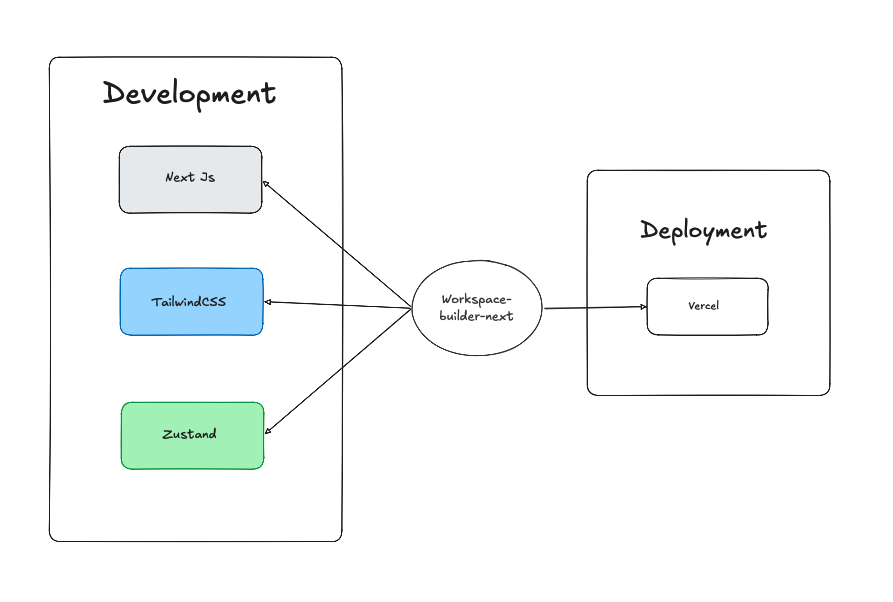

# Monis Workspace Builder

An interactive workspace design tool built for **monis.rent** to visually design and rent their perfect office setup. Users can build their dream workspace visually — select a desk, choose a chair, add accessories, preview it in real-time

---

## Live Demo

**Live URL:**  
https://workspace-builder-next.vercel.app

---

## GitHub Repository

**Repository:**  
https://github.com/fiqrianwar/workspace-builder-next

---

# Features

- Select a desk (minimum 2 options)
- Select a chair (minimum 2 options)
- Add accessories (monitors, lamps, plants)
- Real-time visual workspace preview
- Summary view of selected setup
- Fully deployed on Vercel

---

# Tech Stack

## Required Stack

- **Next.js (App Router)**
- **Tailwind CSS**
- **TypeScript**
- **Zustand**
- **Vercel (Deployment)**

---

# Architecture Overview

The application follows a **component-driven architecture** with a clear separation of concerns between presentation, business logic, and configuration.

The structure is intentionally organized to keep the codebase scalable, maintainable, and easy to extend.

---

### Presentation Layer (UI)

- Built with **Next.js (App Router)** and **TypeScript**
- Responsible for rendering components, routing, and handling user interactions
- Styled using **Tailwind CSS**
- Components remain focused purely on presentation and interaction

The UI layer does not contain pricing calculations or business rules.

---

### State & Business Logic Layer

- Managed using **Zustand**
- Handles:
  - Desk and chair selection
  - Accessory toggling
  - Workspace configuration state
  - Total rental cost

This keeps business logic centralized and decoupled from UI components.

---

### Configuration Layer

- Centralized asset definitions (desks, chairs, accessories)
- Image mappings
- Pricing data

This ensures:

- A single source of truth
- Easy scalability when adding new products
- Clean separation between data and UI

---

## Deployment

- Deployed on **Vercel**
- Optimized using Next.js production build features

---

## 

## Project Structure

```lua
src/
├── app/
│   └── page.tsx
├── components/
│   └── layout/
│   └── primitives/
│   └── ui/
├── constants/
├── features/
│   └── Workspace/
├── lib/
├── store/
```

# What I'd Improve With More Time

- Align visual style more closely with monis.rent branding
- Connect to a backend API for real rental submission
- Store configurations in a database
- Add authentication for returning users
- Implement cart system with checkout confirmation
- Introduce smooth animations
- Improve mobile interaction gestures
- Add onboarding tooltip walkthrough for first-time users
- Optimize image loading strategy
- Add lazy loading for accessory assets
- Implement skeleton loaders
- Dynamic responsive
- Add unit tests
- Add CI/CD
